#### Minesweeper made with emoji. The most fun way to play minesweeper

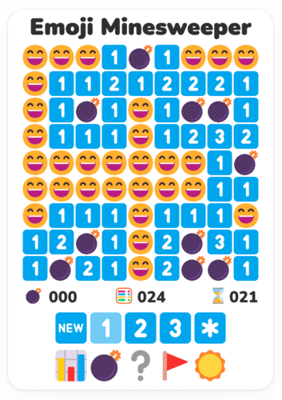
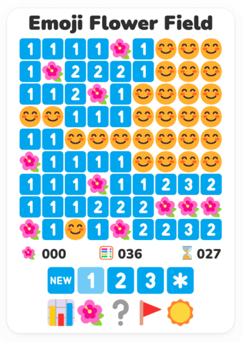

## [Play!](https://www.emojiminesweeper.com/)

Emoji Minesweeper is a **logic puzzle game**, a variant of the classic [minesweeper game](<https://en.wikipedia.org/wiki/Minesweeper_(video_game)>) reimagined and implemented using **emoji**! It features a **grid of clickable squares**, with hidden **mines** (or flowers) scattered throughout the board. Safe squares have **numbers** telling you how many mines touch the square. If there is no number, the square doesn't touch any mine. You can use the number clues to solve the game by opening all of the safe squares. If you click on a mine you **lose** the game!

Emoji Minesweeper **always makes the first click safe**. You open squares with the **left mouse button** and put flags on mines with the **right mouse button**.

The game ends when all safe squares have been opened (**win**) or when a square containing a mine is opened (**loss**). If you win, the empty square get filled with happy faces 😄, and if you lose they get filled with sad faces 😵.

There are **four levels** (beginner, intermediate, expert, and custom) and **six themes** (mine 💣, flower 🌺, mushroom 🍄, bear 🐻, surf 🏄, and Japan 🏯) to choose from.

Lastly, players can choose between light ☀️ and dark 🌔 mode.

## Documentation

Additional information for nerds 🤓 (architecture, technologies, debugging) can be found in the [documentation](./DOCS.md).

## Technologies Used

&nbsp;&nbsp;&nbsp;&nbsp;

&nbsp;&nbsp;&nbsp;&nbsp;

&nbsp;&nbsp;&nbsp;&nbsp;

You can find more information in the [documentation](./DOCS.md#technologies-used).

## How to Play

This is the user interface of Emoji Minesweeper. Such a colorful amalgamation of emoji! On the top, you can see a grid of squares: the board. The black square button emoji 🔲 means that the square has not been opened yet. **Left-click on any square to open it**, and start the game. You don't have to worry about your first move, as we have made sure that your first square can never contain a mine (actually it can, but if that's the case, we relocate the mine to another square so fast that you don't even realize it - you can thank us later). Right below the board you can find three counters.

On the left you can find the **mine counter** 💣. It shows the number of mines on the board without flags (we will talk about flagging shortly).

In the middle, next to the abacus 🧮 you can find the **moves counter**. It keeps track of how many moves you have made since the beginning of each game. By *moves* we mean all the clicks (left and right) you have made on closed squares.

Finally, on the right, you can find an ⌛ hourglass and, more importantly, the **time counter**, keeping track of time: seconds passed since you opened the first square. Now let's go back to our game.

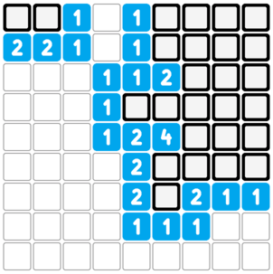

After you click on a square, you will get something like this. When you open a square that does not touch any mines, it will be opened and the adjacent squares will automatically be opened in all directions until reaching squares that contain numbers. A common strategy for starting games is to **randomly click until you get a big opening with lots of numbers**.

The empty squares ⬜️ are safe squares that do not touch any mines. Some safe squares have numbers telling you how many mines touch the square. The numbered squares can be either 1️⃣, 2️⃣, 3️⃣, 4️⃣, 5️⃣, 6️⃣, 7️⃣, 8️⃣. Why don't we have nine as well? Because **each square can be touched by eight square at most**. Most squares are touched by eight other squares. If a square is located on the border of the board, it is touched by six other squares (as one of its sides is not touched by anything), and if a square is located in one of the four corners of the board, it is touched by only three other squares. Let's see an example.

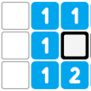

Let's focus on the 1️⃣ square in the middle. It is touched by eight other squares (oh, by the way, diagonal squares count as well). We can observe that all its surrounding squares **but one** have been opened and are safe. On its left, we can see three empty squares and on its top, bottom and right we can see four numbered squares and a closed one. Since its number is 1️⃣, it has to be touched by exactly one mine. **Thus, we can safely assume that the closed square will contain a mine**.

In order to make our life easier, and keep track of the squares containing mines, we can **right-click** on these squares and flag them 🚩 using a red flag.

Be careful, because if you flag more squares than the total number of mines, you won't be able to finish the game, until you unflag some squares. Fortunately, we've got you covered on that too, as the **mine counter will turn red** if you do so.

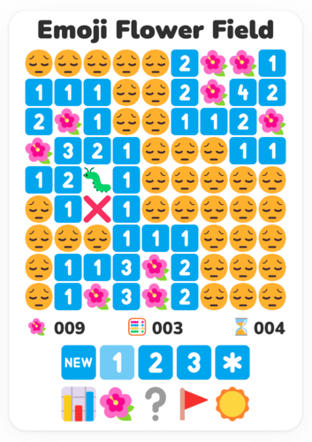

If you click on a mine you lose the game. If you had wrongly flagged any squares as mines they will be marked with an ❌, to help you identify your mistakes.

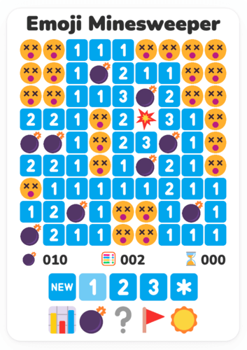

Yeah, losing looks like this.

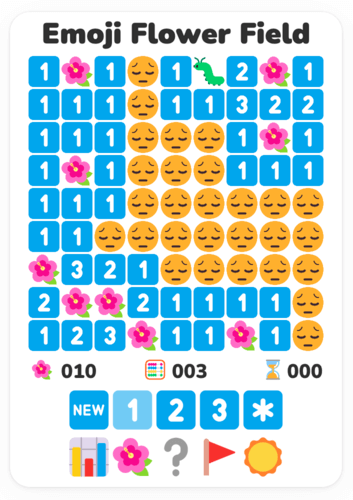

Or like this.

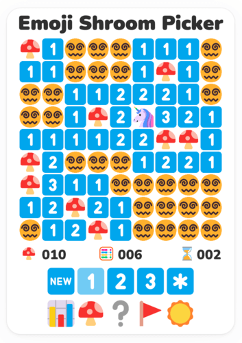

Or like this. Not too bad, huh? In order to win a game, you need to open all the safe squares. When you win or lose a game you need to start a new one. You can achieve that by clicking on the 🆕 button or by pressing the *N key*.

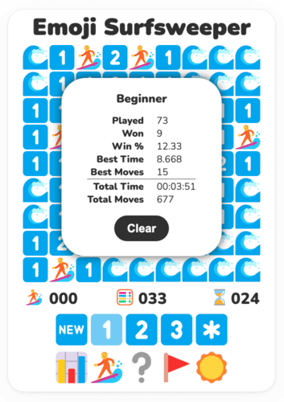

In order to keep track of how good (or bad) you are doing the game keeps your stats. To open the stats modal click the 📊 button. Stats include metrics such as games played, games won, percentage of wins, best time and best moves and are kept separately for each level. Don't worry if you are not doing that well, as you can always clear your data by clicking on the *Clear* button, located inside the stats modal. You can also toggle the stats modal by pressing the *S* key.

If you do a new best time or win the game by the less moves than ever before, not only are your stats updated accordingly, but empty squares become the partying emoji 🥳. The respective counters turn gold as well. In these examples, the player achieved both a new time record and a moves record, thus both counters have turned gold.

There are four difficulty levels, with different board sizes and numbers of mines. Along with the classic and predetermined beginner, intermediate, and expert levels, there's a custom level as well, giving players the ability to set the dimensions of  the board, as well as the number of mines.

|        Level | Dimensions | Mines | % of Mines |
| -----------: | :--------: | :---: | :--------: |
|     Beginner |    9x9     |  10   |  ~12.34%   |
| Intermediate |   16x16    |  40   |  ~15.63%   |
|       Expert |   30x16    |  99   |  ~20.63%   |

You can use the level buttons 1️⃣2️⃣3️⃣*️⃣ to switch between levels. You can also use the *keyboard keys 1, 2, 3, and 4*.

If you click the *️⃣ button, the custom level modal will appear.

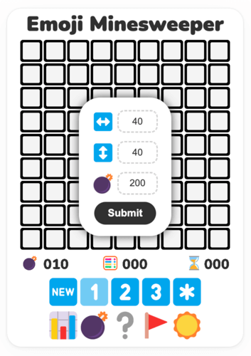

Here you can choose the width, the height, and the number of mines for your desired custom level. When you click Submit, your custom level will appear!

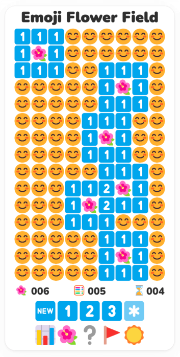

Here is a custom level featuring 9 columns, 15 rows, and 6 mines. Quite long, isn't it?

The game features six themes with different emoji sets to choose from. Apart from the classic mine theme 💣 and the peaceful and relaxing flower theme 🌺, you can find a mushroom theme 🍄, a bear theme 🐻, a surf theme 🏄, and a Japan theme 🏯. You can use the theme button 💣/🌺/🍄/🐻/🏄/🏯 to switch between themes, or use the *left and right arrows* on your keyboard. These are the rest of the themes:

The mushroom theme.

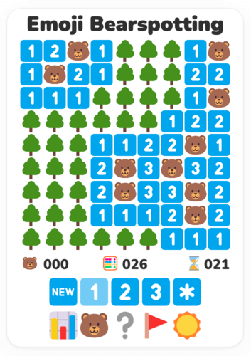

The bear theme.

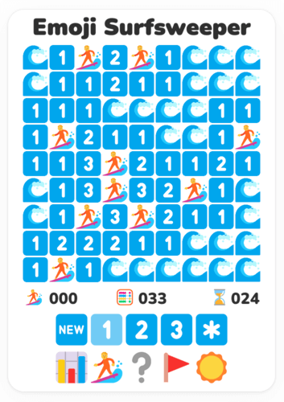

The surf theme.

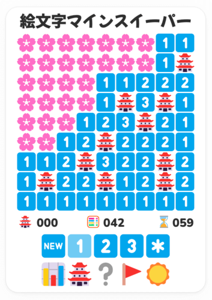

And the Japan theme. I bet you can't decide which one to pick! Your level and theme preferences are saved in your computer, so your next game always starts with the lastly used configuration.

If you forget the basic controls you can click the help button ❔to toggle the help modal. You can also toggle the help modal by pressing the *H* key.

Clicking on the flag button 🚩 will toggle flag mode. This will enable you to flag squares by touching them, or by left-clicking on them. You can also toggle flag mode by pressing the *F* key. You might want to use this if you are on a phone or tablet. If, on the other hand, you are on a computer, the cursor will be changed to a *crosshair*, to inform you that flag mode is enabled.

Lastly, clicking on the  ☀️/🌔  button allows players to choose between light and dark mode. You can also switch between dark and light by pressing the *D* key.

### Summary

- **Left-click** to open a square square
- **Right-click** to flag a square (that you think) contains a mine
- 💣 Mines counter
- 🧮 Moves counter
- ⌛ Time counter
- 🆕 restarts the game
- 1️⃣2️⃣3️⃣*️⃣ buttons switch between **levels** (beginner, intermediate, expert, and custom)
- 📊 button toggles the **stats modal**
- 💣/🌺/🍄/🐻/🏄/🏯 button switches between **themes** (mine, flower, mushroom, bear, surf, and Japan)
- ❔button toggles the **help modal**
- 🚩 button toggles **flag mode** (for touchscreens)
- ☀️/🌔 button toggles **dark mode**

### Keyboard Controls

|     Key     | Action                             |
| :---------: | :--------------------------------- |
|      Ν      | New game (current level and theme) |
|      S      | Open/close stats modal             |
|      1      | Switch to beginner level           |
|      2      | Switch to intermediate level       |
|      3      | Switch to expert level             |
|      4      | Switch to custom level             |
| Left Arrow  | Switch to next theme               |
| Right Arrow | Switch to previous theme           |
|      H      | Open/close help modal              |
|      F      | Toggle flag mode                   |
|      D      | Toggle dark mode                   |

## Feature List

You can find a full(ish) feature list in the [documentation](./DOCS.md#feature-list).

## More Screenshots

### Intermediate Level

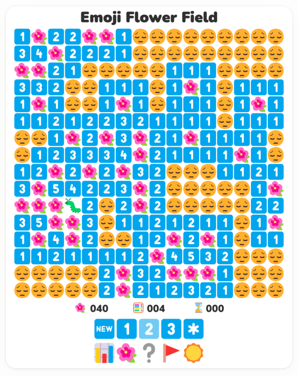

### Expert Level

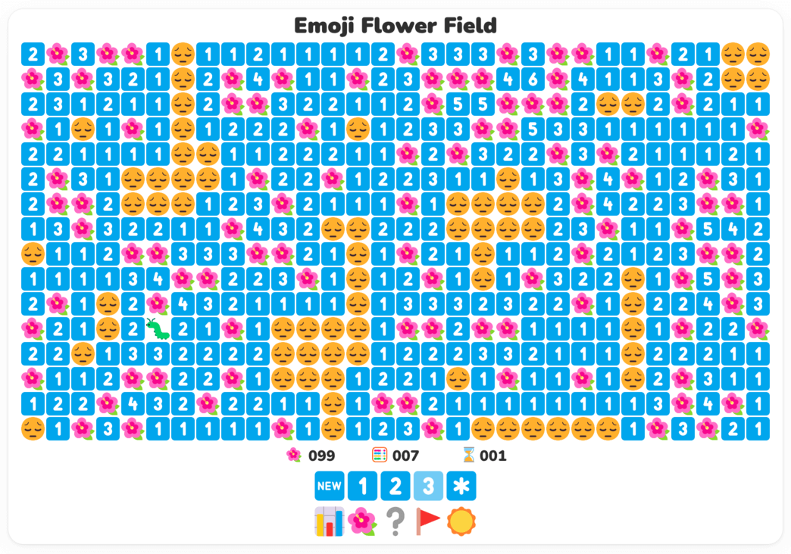

## Emoji

The following emoji are used throughout the game:

🔲 ⬜️ 🔳 ⬛ 🆕 1️⃣ 2️⃣ 3️⃣ 4️⃣ 5️⃣ 6️⃣ 7️⃣ 8️⃣ *️⃣ 📊 ↕️ ↔️ 🚩 ⌛ 🧮 ❔ ❌ 🥳 ☀️ 🌔

### Themes & Emoji Sets

|     Theme     |       Game Title       | Emoji Set     |
| :-----------: | :--------------------: | :------------ |
|     Mine      |   Emoji Minesweeper    | 💣 💥 😄 😵 |
|    Flower     |   Emoji Flower Field   | 🌺 🐛 😊 😔 |
|   Mushroom    | Emoji Mushroom Picker  | 🍄 🦄 😎 😵‍💫 |
|     Bear      |   Emoji Bearspotting   | 🐻 🐾 🌳 🪵 |
|     Surf      |    Emoji Surfsweeper   | 🏄 🦑 🌊 🦈 |
|     Japan     |   絵文字マインスイーパー   | 🏯 👺 🌸 😖 |

The emoji font used in the game is the **Segoe UI Emoji font** that can be found [here](https://web.archive.org/web/20240420021127/https://learn.microsoft.com/en-us/typography/font-list/segoe-ui-emoji). If you are running Windows 11, this font family is already installed on your computer. If you are running Linux, you can install and use the Segoe UI font family by following these [instructions](https://web.archive.org/web/20240221061513/https://vyshnav.xyz/blog/windows-11-emojis-on-linux).

### Emoji History

The first ever modern emoji existed on a device that came even before phones. In 1995, Japanese Telecom Company NTT DoCoMo made the first emoji available on its Pocket Bell pager model. As you can see Emoji Minesweeper is using some of these very first emoji!

You can find more information about the history of emoji [here](https://web.archive.org/web/20230116030836/https://gem-ship-blog.com/blog/the-story-behind-emojis-1).

## Contributors

- [Michael Kolesidis](https://github.com/michaelkolesidis/)
- [Margarita Marmaridou](https://github.com/mamarmar/)
- You can be on this list, too!

## 💖 Support the Project

Thank you so much for your interest in my project! If you want to go a step further and support my open source work, buy me a coffee:

## International Campaign to Ban Landmines

Antipersonnel landmines are explosive devices designed to be detonated by the presence, proximity, or contact of a person. Placed under or on the ground, they can lie dormant for years and even decades until a person or animal triggers their detonating mechanism.

Incapable of distinguishing between the footfall of a soldier and that of a child, antipersonnel mines cannot be aimed. They indiscriminately kill or injure civilians, aid workers, peacekeepers, and soldiers alike. They pose a threat to the safety of civilians during conflicts and long afterwards.

The [International Campaign to Ban Landmines (ICBL)](http://www.icbl.org/) is a coalition of non-governmental organizations whose stated objective is a world free of anti-personnel mines and cluster munitions, where mine and cluster munitions survivors see their rights respected and can lead fulfilling lives. **We urge you to visit their website, get informed, and support their work in any way possible.**

The ICBL, in close partnership with a small number of states, the ICRC, and the UN, put in motion what was later known as the “Ottawa Process” that led to the adoption of the [Mine Ban Treaty](https://web.archive.org/web/20240511072517/https://www.icbl.org/en-gb/the-treaty/treaty-status.aspx) in September 1997. The Mine Ban Treaty, which includes a comprehensive ban on all antipersonnel mines as well as several measures to redress the harm from past use, was adopted in Oslo (Norway) in September 1997, and opened for signature on 3 December 1997 in Ottawa (Canada.)

## License

Copyright (c) 2025 Michael Kolesidis 
Licensed under the [GNU Affero General Public License v3.0](https://www.gnu.org/licenses/agpl-3.0.html).
